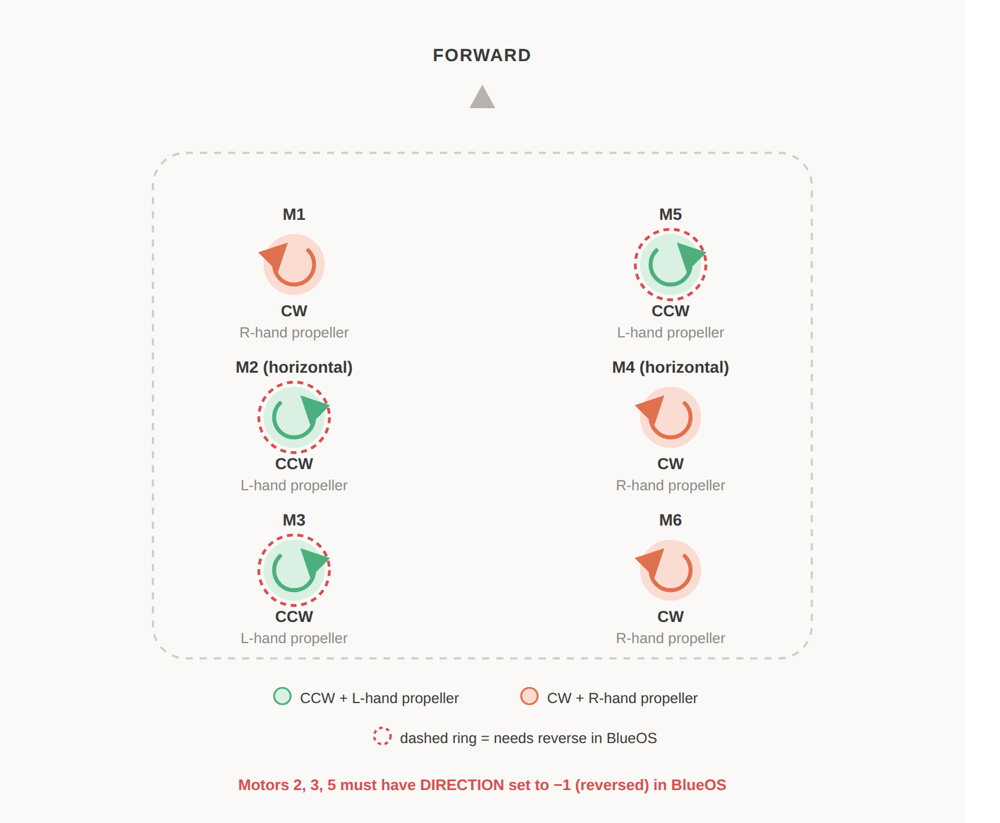

# ArduSub Custom Frame (active_hook ROV)

## Setup, Build & Flash

**1. Fork & clone**
```bash
# Fork smarc-project/ardupilot on GitHub, then:
git clone --recursive https://github.com/<your-username>/ardupilot.git ~/ardupilot
```

**2. Build**
```bash
cd ~/ardupilot
./waf configure --board navigator \
    --toolchain ~/toolchains/gcc-arm-10.2-2020.11-x86_64-arm-none-linux-gnueabihf/bin/arm-none-linux-gnueabihf
./waf sub
```
Toolchain is required because Navigator is ARM (Raspberry Pi) and we're cross-compiling from an x86_64 machine.

**3. Upload (Navigator + BlueOS)**
Compiled file: `~/ardupilot/build/navigator/bin/ardusub`
1. Go to `blueos.local` on your browser → **Autopilot Firmware** → **Upload firmware file**
2. Select `ardusub` → **Install firmware**
3. **Restart autopilot**

**Important note:** You have to set RC3_TRIM to 1100 from parameters page.

**4. Select the frame**
Go to Autopilot Parameters → Set `FRAME_CONFIG` to **Custom** .

## Current Motor Configuration (6 Thrusters)

Defined in `libraries/AP_Motors/AP_Motors6DOF.cpp` → `case SUB_FRAME_CUSTOM:` (frame name: "ASIA MADELEINE", choosen by Ali&Philip, has a reason).

| Motor | Roll | Pitch | Yaw | Throttle | Forward | Lateral | Role |
|---|---|---|---|---|---|---|---|
| 1 | +1.0 | +1.0 | 0 | +1.0 | 0 | 0 | front-left corner (Vertical)|
| 2 | 0 | 0 | +1.0 | 0 | +1.0 | 0 | left mid (Horizontal) |
| 3 | +1.0 | -1.0 | 0 | +1.0 | 0 | 0 | back-left corner (Vertical) |
| 4 | 0 | 0 | -1.0 | 0 | +1.0 | 0 | right mid (Horizontal) |
| 5 | -1.0 | +1.0 | 0 | +1.0 | 0 | 0 | front-right corner (Vertical) |
| 6 | -1.0 | -1.0 | 0 | +1.0 | 0 | 0 | back-right corner (Vertical) |

`lateral_fac` is 0 for every motor — no linear.y capability yet.

## Propeller Rotation & Direction



## Adding New Thrusters (e.g. 6 → 8)

**Code** 
`AP_MOTORS_MOT_7`/`MOT_8` already exist, no new defines needed. Add to the end of `case ASIA MADELEINE:`:

```cpp
add_motor_raw_6dof(AP_MOTORS_MOT_7, <roll>, <pitch>, <yaw>, <throttle>, <forward>, <lateral>, 7);
add_motor_raw_6dof(AP_MOTORS_MOT_8, <roll>, <pitch>, <yaw>, <throttle>, <forward>, <lateral>, 8);
```

**Rebuild & reflash** — repeat steps 2–3 above.

**Params** — set `SERVOx_FUNCTION` on the new outputs to `MotorX`, or you can just assign output 7 as motor7 and output 8 as motor8 in Vehicle Setup -> PWM Outputs page.

